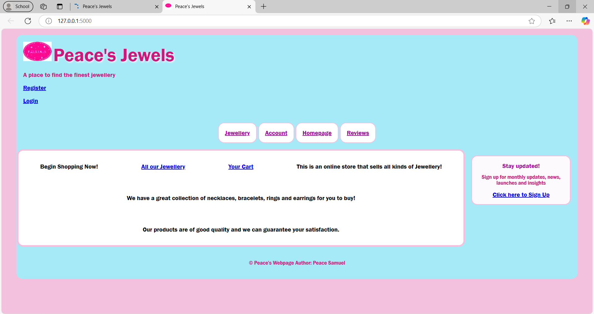
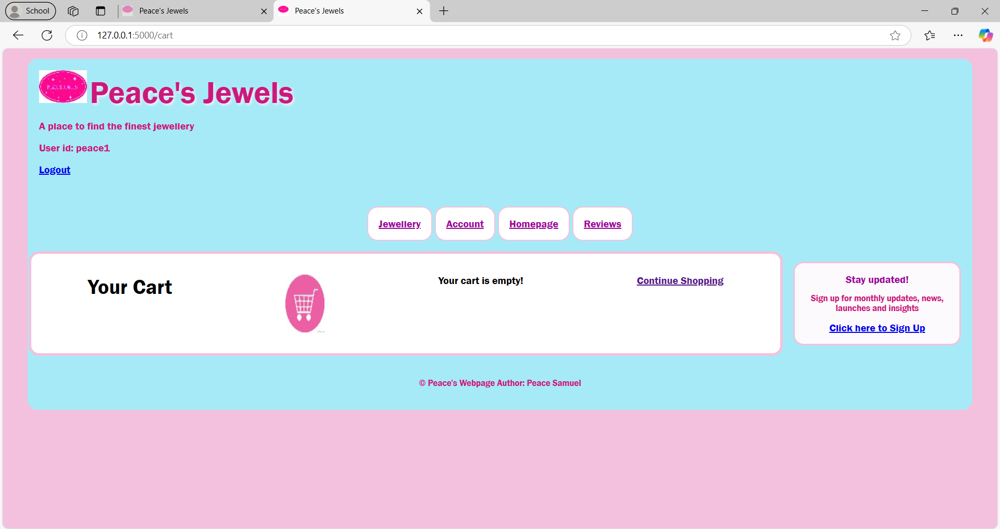
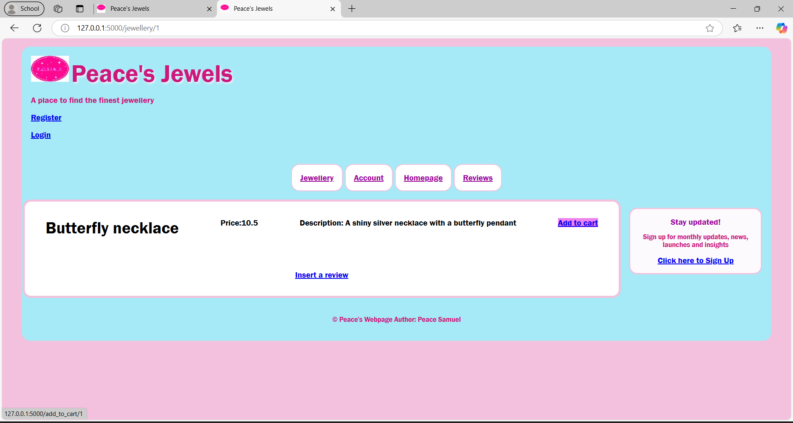

# 💎 Online Jewelry Store — Flask Web Development Assignment
This is a Flask-based web application developed as part of my second-year Web Development assignment for my Computer Science course. The project simulates an online jewelry store with features like product browsing, shopping cart, user accounts, and customer reviews.

## Technologies Used
- Python with Flask (backend)
- SQLite (relational database)
- HTML5 / CSS3 (frontend)
- Flask-WTF (form handling)
- Werkzeug (password hashing)
- Flask-Session (session management)

## Key Features
- User Registration & Login
- Product Listing & Individual Product Pages
- Shopping Cart Functionality
- Secure Checkout Form
- Review System (view and submit reviews)
- Email Subscription Form
- Session-based Cart Management
- Responsive Design (with custom CSS)

## How to run the app
1. Clone or download this repository.
2. Make sure Python and `pip` are installed.
3. Create a virtual environment _(optional)_
```python -m venv venv
source venv/bin/activate  # On Windows: venv\Scripts\activate
 ```
4. Install the requrired packages `pip install flask flask-wtf flask-session`
5. Run the app `flask run`
6. Open browser _(should be at: http://127.0.0.1:5000)_

## Screenshots




## Credits
Created by Peace Samuel.
Part of Year 2 Computer Science, Web Development Module
